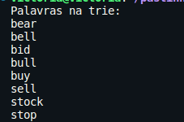
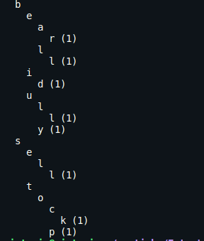
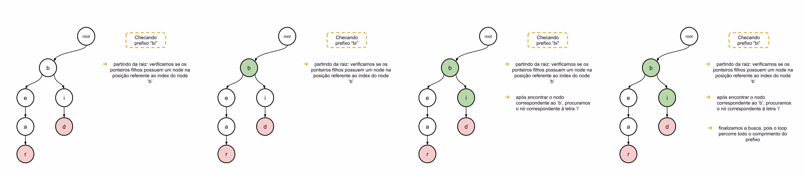
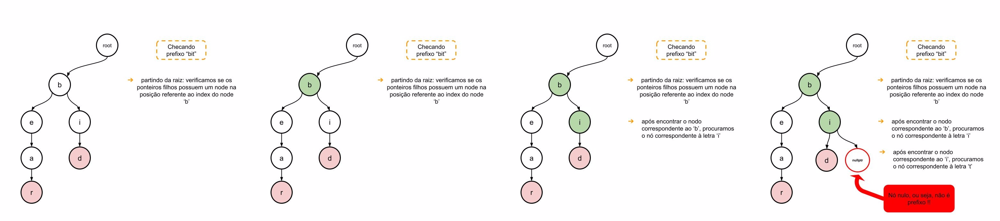

<div style="text-align: center;">
  <h2>Trabalho 02 | Estrutura de dados - INE5408</h2>
</div>

**Alunos**: Eduardo Achar - 23102448
Victória Rodrigues Veloso - 23100460 

---

# 1. Resumo

O trabalho proposto tem como finalidade a construção e utilização da estrutura hieráquica `trie` para a indexação e recuperação de palavras. A implementação foi dividida na resolução de dois problemas que resumidamente consistem em:

- Problema 1: construção da trie em memória principal a partir das palavras definidas no arquivo dicionário.
- Problema 2: fornecer saídas específicas ao consultar se uma palavra está presente ou é um prefixo de outras palavras na trie. 


# 2 Algoritmos

Para a resolução dos problemas propostos, foi desenvolvida uma classe Trie utilizando templates e práticas de orientação a objetos.

## 2.1 Construção da trie em memória principal

Para efetuar a construção da Trie, uma estrutura Node foi criada, baseada na struct definida por (VENKI, 2024), para representar cada caracter da palavras que seria inserida. 

```cpp
    struct Node {
        char letra;
        Node* filhos[26]; // 26 letras do alfabeto
        size_t fim_de_palavra; // Se for maior que zero, indica que o nó é o final de uma palavra
        int i; // Posição do primeiro caracter da palavra
        int j;  // Tamanho da linha

        // Construtor do nó
        Node(char c) : letra(c), fim_de_palavra(0), i(0), j(0) {
            for (size_t i = 0; i < 26; i++) {
                filhos[i] = nullptr;
            }
        }
    };
```
<div style="text-align: center;">
  <p style="font-size: smaller;">Figura 1. Struct Node desenvolvida para a Trie.</p>
</div>

Além da estrutura Node, algumas funções auxiliares como `visualize` e `print` foram adicionadas para ajudar no desenvolvimento.
Na Figura 3, observa-se a hierarquia da árvore construída. O índice `1` indica o caractere final da palavra. As letras que possuem a mesma indentação estão no mesmo nível da árvore. Por exemplo, em 'bear' e 'bell', as letras 'a' e 'l' têm a mesma indentação, indicando que estão no mesmo nível e compartilham o prefixo "be".

<div style="text-align: center;">
  
    <p style="font-style: italic; font-size: 12px;">Figura 2. Palavras inseridas na árvore exibidas no console através da função print."</p>
</div>


<div style="text-align: center;">
  
    <p style="font-style: italic; font-size: 12px;">Figura 3. Visualização dos nós da árvore."</p>
</div>

```cpp
private:
    void delete_node(Node* node); // Método auxiliar para deletar um nó
    void print(Node* node, string prefix) const; // Método auxiliar para imprimir a trie
    void visualize(Node* node, string prefix, int level)const;

public: //se necessário, adicionar mais métodos futuramente
    Trie(); // Construtor da trie
    ~Trie(); // Destrutor da trie

    bool empty() const; // Método para verificar se a trie está vazia
    size_t size() const; // Método que retorna o tamanho da trie
    void insert(const string& palavra, int i, int j); // Método para inserir uma palavra na trie
    void print() const; // Método para imprimir as palavras na trie
    size_t checkPrefix(const string& prefix); // Método para verificar se um prefixo existe na trie
    void visualize() const; // Método para visualizar a trie 
    size_t countPrefix(Node* node); // Método para contar número de fim de nodos de fins de palavras a partir de um nodo

```
<div style="text-align: center;">
  <p style="font-size: smaller;">Figura 4. Métodos da árvore de prefixos .</p>
</div>

## 2.2 Inserção das palavras definidas no arquivo dicionário

Um dos  principais métodos construídos é o método `insert`, utilizado para solucionar um dos tópicos do primeiro problema. Assim como a struct Node, o método insert também foi baseado artigo (VENKI, 2024), porém com adaptações.

O método parte da raiz e, a partir de um loop, percorre os caracteres da palavra e verifica se eles já estão presentes na árvore. Essa verificação é baseada em obter o índice da tabela ASCII da letra, obtendo sua posição no alfabeto. Se o índice não estiver presente nos filhos do caracter atual, então criamos um novo nó na posição do index, a fim de representar a letra.

Essa função também insere no último nodo a posição do primeiro caracter da palavra (i) e o tamanho da linha que a descreve (j).

```cpp
template<typename T>
void Trie<T>::insert(const string& palavra, int i, int j) {

    Node* atual = root;
    //itera através dos caracteres da strind palavra

    //calcula o índice da letra
    for (size_t i = 0; i < palavra.size(); i++) {
        size_t index = palavra[i] - 'a';   
        
        //se o filho não existir, cria um novo nó
        if (atual->filhos[index] == nullptr) { 
            atual->filhos[index] = new Node(palavra[i]);
        }

        //atualiza o nó atual para o nó filho recem criado ou que já existia
        atual = atual->filhos[index];
    }

    // depois de processar todos os caracteres da palavra, marca o nó final como 1, indicando que a palavra termina ali
    atual->fim_de_palavra++;
    atual->i = i; 
    atual->j = j; 
    size_++;
}
```
<div style="text-align: center;">
  <p style="font-size: smaller;">Figura 5. Método insert</p>
</div>

A leitura das palavras recebidas pelo usuário é feita pela main na seguinte parte do código:

```cpp
    // Variaveis auxiliares atividade
    string filename;
    string word;

    // Variaveis auxiliares leitura arquivo
    string word_append; // Palavra a ser adicionada na Trie
    char c; // Caracter atual
    int i = 0; // Posição do primeiro caracter da palavra
    int j = 0; // Tamanho da linha
    string line; // Linha do arquivo
    size_t start; // Posição do colchete de abertura
    size_t end; // Posição do colchete de fechamento

    //Entrada
    cin >> filename;

    // Trie
    Trie<string> trie;

    // Abrindo arquivo
    ifstream filexml(filename);

    // Leitura do arquivo e inserção na trie
    while (getline(filexml, line)) {
        
        // Posição do primeiro caracter da próxima linha
        i = filexml.tellg();
        
        // Tamanho da linha atual
        j = line.length();
        
        // Começo da palavra sinalizado por '['
        start = line.find('[');
        
        // Final da palavra sinalizado por ']'
        end = line.find(']');
        
        // Garante a ordem dos colchetes
        if (start < end) {
            
            // A palavra a ser adicionada na Trie é
            // Uma substring que começa após o colchete de abertura
            // E acaba antes do colchete de fechamento
            word_append = line.substr(start + 1, end - start - 1);
            
            // i - j - 1 é a posição do primeiro caracter da linha
            // ja que i é a primeira posição da próxima linha e
            // j é o comprimento da linha atual
            trie.insert(word_append, i - j - 1, j);
        }
    }

    filexml.close();
```
<div style="text-align: center;">
  <p style="font-size: smaller;">Figura 6 Leitura dos inputs.</p>
</div>


## 2.3 Verificação de prefixos

Para verificar se uma palavra é um prefixo das que já estão inseridas na árvore, um método que recebe o prefixo como parâmtro foi criado. 
O método consiste em percorrer os caracteres do prefixo e verificar se ele está presente na árvore. Caso não esteja, então não é um prefixo.

```cpp
template<typename T>
size_t Trie<T>::checkPrefix(const string& prefix) {
    Node* atual = root;

    //loop verifica se é prefixo e aponta para a última letra do prefixo
    for (size_t i = 0; i < prefix.size(); i++) {

        //calcula o índice da letra atual do prefixo
        int index = prefix[i] - 'a';
      
        //se o filho existir (ou seja, a letra atual do prefixo estiver na arvore), atualiza o nó atual
        if (atual->filhos[index] != nullptr) {

            //pegamos a letra seguinte para verificar se é prefixo
            atual = atual->filhos[index];

        // caso não seja prefixo de nenhuma palavra, retorna 0
        } else {
            cout << prefix << " is not prefix" << endl;
            return 0;
        }
    }

    // chama a função countPrefix para o último nodo do prefixo
    cout << prefix << " is prefix of " << countPrefix(atual) << " words" << endl;

    // se o prefixo for uma palavra, imprime a posição da palavra
    if (atual->fim_de_palavra > 0) {
        cout << prefix << " is at (" << atual->i  << "," << atual->j << ")"<< endl;
    }
    return countPrefix(atual);

} //checkPrefix

```
<div style="text-align: center;">
  <p style="font-size: smaller;">Figura 7. Método para checar se é um prefixo.</p>
</div>
Alguns exemplos visuais foram desenvolvidos para podermos visualizar melhor como a busca é efetuado na estrutura hierárquica desenvolvida. Na figura 8, demonstramos a busca do prefixo `bi`, enquanto na figura 9 procuramos o prefixo `bit`que não está presente.


<div style="text-align: center;">
  
    <p style="font-style: italic; font-size: 12px;">Figura 8. Demonstração da busca de um prefixo existente na árvore.</p>
</div>

<div style="text-align: center;">
  
    <p style="font-style: italic; font-size: 12px;">Figura 9. Demonstração da busca de um prefixo não existente na árvore.</p>
</div>


## 2.4 Cálculo do número de nodos que são fim de alguma palavra a partir de um nodo dado

Outro algoritmo desenvolvido durante o trabalho foi implementado na função countPrefix. Essa função recebe um nodo e a partir dele percorre de forma recursiva todos os seus filhos e os filhos de seus filhos sucessivamente e conferindo se cada um desses nodos tem o atributo 'fim_de_palavra' > 0. Esse algoritmo é útil pois é dessa forma que sabemos quantas palavras possuem determinado prefixo, sendo o prefixo o caminho de palavras que precedem aquele nodo. Essa função só é usada caso esse prefixo existe na árvore, nesse caso obrigatoriamente é prefixo de uma palavra, por estar presente na Trie.

```cpp
// função recursiva para calcular o número de fim de palavras a partir de um nodo
template<typename T>
size_t Trie<T>::countPrefix(Node* node) {
    size_t contador = 0;

    // Verifica se o próprio nó é o fim de uma palavra
    if (node->fim_de_palavra) {
        contador++;
    }

    // percorre todos os nós filhos desse nodo somando o countPrefix de cada
    for (size_t i = 0; i < 26; i++) {
        if (node->filhos[i] != nullptr) {
            contador += countPrefix(node->filhos[i]);
        }
    }
    return contador;
}
```
<div style="text-align: center;">
  <p style="font-size: smaller;">Figura 10. Método para contagem de palvras que possuem o prefixo.</p>
</div>


# 3. Conclusão

A implementação da estrutura de dados Trie demonstrou ser eficiente para a indexação e recuperação de palavras, cumprindo com os requisitos propostos no trabalho. A Trie permite a inserção e busca de palavras de forma rápida, bem como a verificação de prefixos, o que a torna uma estrutura de dados poderosa para diversas aplicações, como dicionários e sistemas de auto-completar.
As funções desenvolvidas para auxiliar na resolução do problema, print e visualize, trouxeram uma visão dimensional da estrutura contribuindo para o entendimento de sua funcionalidade.

# 4. Referências

VENKI. Trie Data Structure | Insert and Search. Disponível em: https://www.geeksforgeeks.org/trie-insert-and-search/. Acesso em: 05 jun. 2024.