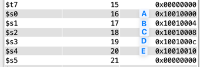

<div style="text-align: center;">
  <h2>Relatório 01 | Organização de computadores I - INE5411</h2>
</div>

**Alunos**: Pedro Henrique Gimenez - 23102766
Victória Rodrigues Veloso - 23100460 

---

# 1. Exercício 1

Para o primeiro exercício, duas operações de alto nível foram realizadas em linguagem Assembly:

1. A = B + 35
2. C = D - A + E

Sendo que os conteúdos das variáveis deveriam ser definidas pelos estudantes.

## 1.1 Implementação

A implementação do exercício 1 foi realizada na ferramenta MARS, o código possui 69 linhas no total.

### 1.1.1 Alocação de Variáveis

Iniciamos o código salvando as variáveis A, B, C, D e E na memória de dados (.data) e as strings para impressão dos resultados no console. Em seguida, carregamos o endereço das variáveis para indicar onde elas esão localizadas utilizando a instrução *load adress* (la).

```assembly
	# ---- alocando variaveis no registrador -----
	la	$s0, A  
	la	$s1, B
	la	$s2, C
	la	$s3, D
	la	$s4, E

```

Para deixar a leitura mais fácil, decidimos que os registradores $s e $t possuam o mesmo numero de identificação para cada letra que o representa, sendo:
- A = \$s0 e \$t0
- B = \$s1 e \$t1
- C = \$s2 e $t2
- D = \$s3 e $t3
- E = \$s4 e $t4

### 1.1.2 Operação 1: A = B + 35

Para realizar esta operação, temos que somar B à constante 35, logo os seguintes passos foram seguidos:

- Carregamos o valor de B para um registrador temporário B, utilizando a instrução *load word* (lw). 
- Adicionamos a constante 35 a B por meio da instrução *addition immediate* (addi) e salvamos num registrador temporário de A.
- Carregamos o valor que está no registrador temporário de A para o registrador de salvamento $s0, por meio da instrução *store word* (sw).


```assembly
	# ---- 1a operacao A = B + 35 -----

	lw	$t1, 0($s1) # carregando temp B
	addi	$t0, $t1, 35 # salvando B + 35 em temp A
	sw	$t0, 0($s0) # carregando temp A no registrador destino na memória
```
### 1.1.3 Operação 2: C = D - A + E

Para realizar esta operação, tivemos que:

- Carregar o valor de D e E para registradores temporários, por meio da instrução *load word* (lw).
- Fazer a subtração entre D e A (instrução sub) e armazenar o resultado em um registrador temporário que representa C.
- Adicionar o valor de E ao resultado anterior (no registrador temporario de C) e sobrescrever o resultado final no registrador temporário de C, por meio da instrução de adição (add).
- Salvar o conteúdo do registrador temporário de C no registrador de salvamento de C, pela instrução *store word* (sw).

Isto pode ser visto no código:

```assembly
# ---- 2a operacao C = D - A + E -----
	lw	$t3, 0($s3) # carregando D
	lw	$t4, 0($s4) # carregando E
	
	sub	$t2, $t3, $t0 # carregando D - A em temp C
	add	$t2, $t2, $t4 # carregando resultado anterior + E em temp C
	
	sw	$t2, 0($s2) # salvando o resultado em C
```

### 1.1.4 Impressão dos Resultados

Para uma melhor visualização dos dados, realizamos a impressão dos resultados de cada operacao no console. Para isso, o código:

- Imprime a string "Valor de A após operação (B + 35): ".
- Imprime o valor calculado para A.
- Imprime uma nova linha.

Estas operações foram feitas salvando o comando de impressão (4) no registrador \$v0 por meio do *load immediate* (li) e depois alocando as strings e o resultado para impressão no registrador de saída \$a0 por meio da instrução *load address* (la). Por fim, se chama *syscall* para o código rodar a operação que está em $v0.

A implementação disso, pode ser observada no código:

```assembly
# --- imprimindo resultado de A ----
	
	# imprimindo string para A
	li	$v0, 4
	la	$a0, valorA
	syscall
	
	# imprimindo A
	li	$v0, 1
	li	$a0, 0
	add	$a0, $a0, $t0
	syscall
	
	# imprimindo nova linha
	li	$v0, 4
	la	$a0, newline
	syscall
```

## 1.2 Executando o Programa
Para conferir se o programa em Assembly está funcionando como deve, separamos em etapas e disponibilizar *prints* da ferramenta MARS de como o banco de memória e registradores está naquele momento.

### 1.2.1 Alocação de Variáveis
Definimos as variáveis com os seguintes valores no .data e depois com os seguintes registradores:
- A = 0 e $s0
- B = 15 e $s1
- C = 0 e $s2
- D = 20 e $s3
- E = 25 e $s4

Podemos analisar que o processo foi concluido com sucesso, pois os endereços foram alocados no banco de registradores (Figura 1) e seus valores foram salvos na memória (Figura 2).

<div style="text-align: center;">
    
    <p style="font-style: italic; font-size: 12px;">Figura 1. Banco de registradores após a alocação das variáveis</p>
</div>

<div style="text-align: center;">
    
    <p style="font-style: italic; font-size: 12px;">Figura 2. Memória após a alocação das variáveis</p>
</div>

### 1.2.2 Operação 1: A = B + 35
Nesta operação acontecem as seguintes modificações nos registradores:
- \$t1 recebe o conteudo dentro de \$s1 (15)
- soma \$t1 com 35 e salva em $t0 (15 + 35 = 50)
- \$t0 é salvo dentro do endereço de \$s0

Assim, os registradores deveriam ficar:
- \$t1 = 15
- \$t0, \$s0 = 50

Estas operações podem ser vistas na Figura 3. 
<div style="text-align: center;">
    
    <p style="font-style: italic; font-size: 12px;">Figura 3. Banco de Registradores e Memória após a 1a operação</p>
</div>

Após isso, foi impresso no console o resultado da operação realizada em A (Figura 4).
<div style="text-align: center;">
    
    <p style="font-style: italic; font-size: 12px;">Figura 4. Mensagem impressa no console após a 1a operação</p>
</div>

### 1.2.3 Operação 2: C = D - A + E
Para a 2a operação, as mudanças no banco de registradores e memória foram:
- \$t3 recebe conteúdo em \$s3 (20)
- \$t4 recebe conteúdo em \$s4 (25)
- \$t2 recebe \$t3 - \$t0 (t2 = 20 - 50 = -30)
- \$t2 recebe \$t2 + \$t4 (t2 = -30 + 25 = -5)
- Conteúdo em \$s2 recebe \$t2

Assim, os registradores deveriam ficar:
- \$t2, \$s2 = -5
- \$t3 = 20
- \$t4 = 25

Estas operações podem ser vistas na Figura 5. 
<div style="text-align: center;">
    
    <p style="font-style: italic; font-size: 12px;">Figura 5. Banco de Registradores e Memória após a 2a operação</p>
</div>

Após isso, foi impresso no console o resultado da operação realizada em C (Figura 6) e o programa foi encerrado.
<div style="text-align: center;">
    
    <p style="font-style: italic; font-size: 12px;">Figura 6. Mensagem impressa no console após a 2a operação</p>
</div>

# 2. Exercício 2

O segundo exercício segue uma abordagem semelhante ao primeiro, com a diferença de que, em vez dos valores das variáveis serem pré-definidos no programa, a variável 'B' deve ser fornecida pelo usuário através do teclado.

## 2.1 Implementação

### 2.1.1 Alterações na Codificação Assembly

Para o segundo exercício, foram feitas poucas alterações no código do exercício anterior. Todos os passos foram realizados de maneira semelhante, exceto por uma adaptação que permite que o usuário forneça o valor da variável 'b'. O trecho de código a seguir ilustra esse ajuste.


```assembly
	# recebendo a entrada (input)
	li 	$v0, 5 # carrega comando de ler inteiro
	syscall 
	move 	$t1, $v0 # salva o inteiro dado para t0
	sw	$t1, 0($s1) # salvando B na memoria

```
## 2.2 Executando o programa
Para garantir que a variável estava sendo lida corretamente pelo teclado, ativamos pontos de depuração para visualizar os conteúdos armazenados nos registradores $t1 e $s1 (registradores associados à variável B). Nas figuras abaixo, podemos observar que o processo ocorreu conforme o esperado:

<div style="text-align: center;">
    
    <p style="font-style: italic; font-size: 12px;">Figura 7. Registrador recebendo o valor de 'B' pelo teclado</p>
</div>


Além disso, também realizamos alguns testes inserindo diferentes valores de entrada para 'B', para verificar que se os cálculos iriam fornecer os resultados corretos, considerando D = 20 e E = 25.

<div style="text-align: center;">
    
    <p style="font-style: italic; font-size: 12px;">Figura 8. Saída com B = 3</p>
</div>

<div style="text-align: center;">
    
    <p style="font-style: italic; font-size: 12px;">Figura 9. Saída com B = 16</p>
</div>

<div style="text-align: center;">
    
    <p style="font-style: italic; font-size: 12px;">Figura 10. Saída com B = 340</p>
</div>

# Conclusão

Através das simulações do programa em Assembly, foi possível obter resultados condizentes com os esperados para as operações. Além disso, proporcionou uma melhor visualização de como ocorre o deslocamento de variáveis entre a memória e o banco de registradores durante a execução de um programa. Isso tornou mais claro, de forma prática, o conteúdo teórico visto em sala de aula.