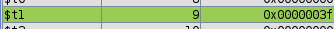
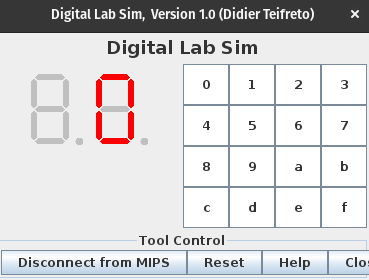
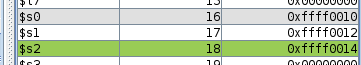
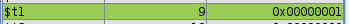
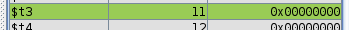
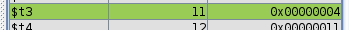
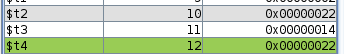
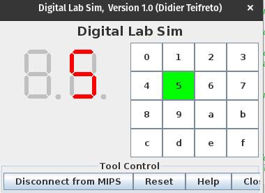

<div style="text-align: center;">
  <h2>Relatório 02 | Organização de computadores I - INE5411</h2>
</div>

**Alunos**: Pedro Henrique Gimenez - 23102766
Victória Rodrigues Veloso - 23100460 

---

# 1. Exercício 1

Para o primeiro exercício, desenvolvemos um programa em assembly para exibir os números de 0 a 9 em um dos displays de 7 segmentos de forma sequencial.

## 1.1 Implementação

### 1.1.1 Armazenamento dos dados

Inicialmente, criamos uma estrutura chamada "numero" para armazenar os valores de 0 a 9 em hexadecimal, facilitando a lógica de codificação do programa.

```assembly
numero:
	.word	0x3F   			# 0
    .word 	0x06   			# 1
    .word 	0x5B   			# 2
    .word 	0x4F   			# 3
    .word 	0x66  			# 4
   	.word 	0x6D  			# 5
    .word 	0x7D  			# 6
   	.word 	0x07   			# 7
   	.word 	0x7F  			# 8
   	.word 	0x6F   			# 9

```

### 1.1.2 Área de programa

Inicializamos um contador para controlar qual número seria exibido e também o endereço do display usado para exibir os números. Em seguida, iniciamos um loop. Carregamos o número que será mostrado no display de acordo com o contador, enviamos para o display e incrementamos o contador em 4 para acessar o próximo número. A instrução "branch on not equal" verifica se o contador chegou a 40 (4 bytes * 10 números que serão exibidos) e encerra o ciclo, levando o programa a executar a instrução "jump", que nos leva a repetir o ciclo novamente.

```assembly

loop:
    	lw 	$t1, numeros($t0)     	# carregando o número que será mostrado no display (de acordo com o contador)
    	sb 	$t1, 0($s0)		        # envia o número para o display
    
    	addi 	$t0, $t0, 4         	# incrementa o contador em 4 para acessar o próximo número a ser exibido
    	bne 	$t0, 40, loop        	# repete até que todos os números de 0 a 9 tenham sido exibidos (contador < 10*4)
    
j main # se acabou, ele volta para o início para fazer um novo ciclo de 0 a 9

```

## 1.2 Execução do programa

Para a execução do programa um temporizador foi acrescentado, a fim de aumentar o intervalo de exibição entre os números, abaixo é possível visualizar o trecho de código em que esse tratamento é feito.

```assembly 
temporizador:
    	addi	$t2, $t2, 1		# incrementa temporizador
    	bne	$t2, 40000, temporizador	
    
    	addi 	$t0, $t0, 4         	# incrementa o contador em 4 para acessar o próximo numero a ser exibido
    	bne 	$t0, 40, loop  
```

### 1.2.1 Alocação de variáveis nos registradores

Durante a depuração do programa, observamos o valor inicial armazenado no registrador destinado ao contador, conforme mostrado na Figura 2.

<div style="text-align: center;">
    
    <p style="font-style: italic; font-size: 12px;">Figura 2. Registrador temporário do contador </p>
</div>

Em seguida, visualizamos o registrador temporário $t1 após receber o conteúdo da estrutura "numero" na posição do contador, como ilustrado na Figura 3. Neste caso, o contador está em 0 e "numero" deve receber a representação hexadecimal de zero.

<div style="text-align: center;">
    
    <p style="font-style: italic; font-size: 12px;">Figura 3. Registrador temporário do contador </p>
</div>

Além disso, também podemos visualizar o registrador que armazena o endereço do display selecionado (display da direita), conforme mostrado na Figura 4.

<div style="text-align: center;">
    
    <p style="font-style: italic; font-size: 12px;">Figura 4. Registrador com endereço do display </p>
</div>

Após a execução do primeiro loop do programa, o número inicial da estrutura "numero" é exibido, representando o número 0, como ilustrado na Figura 5.

<div style="text-align: center;">
    
    <p style="font-style: italic; font-size: 12px;">Figura 5. Exibição do número no display </p>
</div>

Após a exibição do número, o contador é atualizado para 4, a fim de acessar o próximo número (representando o número 1) na estrutura "numero", conforme demonstrado na Figura 6.

<div style="text-align: center;">
    
    <p style="font-style: italic; font-size: 12px;">Figura 6. Registrador temporário do contador </p>
</div>

# 2. Exercício 2

Para o segundo exercício, ao invés dos números de 0 a 9 serem exibidos sequencialmente no display, uma lógica deveria ser implementada para que a leitura de um teclado alfanumérico enviasse o número para o display

## 2.1 Implementação 

Na implementação do código, foram adicionados alguns rótulos, como "key_event" e "display_print", que representam pontos de entrada ou referência, com o objetivo de facilitar a manipulação dos dados e estruturar melhor o código.


### 2.1.1 Armazenamento dos dados

Assim como para o exercício anterior, uma estrutura foi montada para armazenar os endereços de memória do teclado alfa numérico e outra para armazenar o valor em hexadecimal do valor a ser exibido no display. A fim de otimizar espaço no relatório, o trecho de código não foi disponibilizado aqui, mas pode ser visualizado no arquivo "ex2.asm".

### 2.1.2 Área de programa

Além do endereço do display a ser utilizado para exibir os números, neste exercício também foram salvos os endereços do selecionador de linha e o endereço onde ficam salvos os valores das leituras realizadas no teclado.

```assembly
	li 	$s0, 0xffff0010		# salva endereço do display de 7 segmentos
	li 	$s1, 0xffff0012		# salva endereço do selecionador de linhas
	li 	$s2, 0xffff0014		# salva endereço do receptor de leitura do teclado
```

O contexto principal do código se encontra no rótulo "row_check", que é responsável por verificar em qual linha a tecla selecionada se encontra. Para isso, percorremos todas as linhas do teclado, iniciando pela primeira. 
Após verificar a linha 1 e não encontrar nenhuma tecla pressionada, o programa incrementa o valor em `$t1` para avançar para a próxima linha. Este processo é repetido até que uma tecla seja pressionada ou até que todas as linhas tenham sido verificadas.

Quando uma tecla é pressionada e detectada, o programa entra na rotina `key_event`, que é responsável por determinar qual tecla foi pressionada e exibir o valor correspondente no display de 7 segmentos.

Dentro da rotina `key_event`, há um loop que verifica cada valor de tecla possível e compara com o valor armazenado em `$t2`, que contém o valor da tecla pressionada. Quando uma correspondência é encontrada, o programa avança para a rotina `display_print`, onde o valor correspondente é enviado para o display de 7 segmentos para ser exibido.

O temporizador entra em ação após o valor ser exibido no display. Ele cria uma pausa de tempo para garantir que o valor permaneça visível por um curto período antes de retornar ao loop principal para verificar novamente as teclas pressionadas.

Então, o fluxo geral do programa é:

1. Verificar cada linha do teclado para verificar se uma tecla foi pressionada.
2. Se uma tecla for pressionada, determinar qual tecla foi pressionada e exibir o valor correspondente no display de 7 segmentos.
3. Após a exibição do valor, pausar temporariamente antes de retornar ao loop principal para verificar novamente as teclas pressionadas.


## 2.2 Execução do programa

A fim de melhor visualizar a excecução do programa, abaixo é possível visualizar uma sequência de figuras que ilustram a exibição do número 5 no display.

Inicialmente, armazenamos os valores do display em que os números serão exibidos em \$s0, do seletor da linha lida em \$s1 e do receptor da tecla lida no telcado em $s2

<div style="text-align: center;">
    
    <p style="font-style: italic; font-size: 12px;">Figura 7. Registradores  </p>
</div>

<div style="text-align: center;">
    
    <p style="font-style: italic; font-size: 12px;">Figura 8. Registrador $t1 armazenando a linha que será analisada </p>
</div>

Após verificar a linha 1, o programa certifica que a tecla não está presente nela, então incrementa "1" no registrador \$t1, que dentro do loop, verifica que o seletor da linha contém aquele valor. Então, o valor armazenado em \$s2 (receptor do teclado), envia o conteúdo que seu endereço está apontando para o registrador $t2

<div style="text-align: center;">
    
    <p style="font-style: italic; font-size: 12px;">Figura 9.  </p>
</div>

O registrador \$t3 (como um contador)é então iniciado, a fim de percorrer os endereços do teclado e comparar com o valor armazenado em \$t2.

<div style="text-align: center;">
    
    <p style="font-style: italic; font-size: 12px;">Figura 10. Registrador $t3 iniciado </p>
</div>

Então temos a comparação do conteúdo recebido pelo teclado (armazenado em \$t2), com o primeiro elemento associado ao contador valor_teclado($t3) = 0.

<div style="text-align: center;">
    
    <p style="font-style: italic; font-size: 12px;">Figura 11. Instante em que o número lido no teclado ainda é diferente do número analisado. </p>
</div>

Ao verificar que são diferentes, o contator $t3 é incrementado em 4, a fim de comparar com o próximo elemento.

<div style="text-align: center;">
    
    <p style="font-style: italic; font-size: 12px;">Figura 12. Incremento do contador </p>
</div>


<div style="text-align: center;">
    
    <p style="font-style: italic; font-size: 12px;">Figura 13. Instante em que o número lido no teclado é encontrado</p>
</div>

Com o conteúdo dos registradores sendo igual, o programa busca na estrutura "numero_7seg" o conteudo na posição do contador $t3, que corresponde ao número que será exibido e envia ao display.

<div style="text-align: center;">
    
    <p style="font-style: italic; font-size: 12px;">Figura 14. Exibição do número lido no teclado alfanumérico</p>
</div>