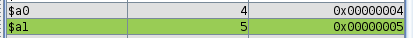
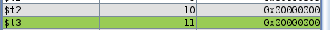
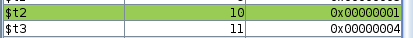
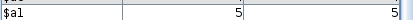
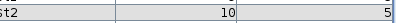
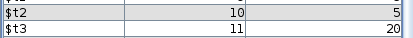

<div style="text-align: center;">
  <h2>Relatório 03 | Organização de computadores I - INE5411</h2>
</div>

**Alunos**: Pedro Henrique Gimenez - 23102766
Victória Rodrigues Veloso - 23100460 

---

# 1. Exercício 1

Para o exercício número 1, um algoritmo para realozar a multiplicação através de somas sucessivas foi implementado.

## 1.1 Implementação

### 1.1.1 Principais pontos do algoritmo

O programa inicia utilizando a isntrução jump, e é então direcionado para a main. Inicialmente, os dados possuem seus endereços carregados na memória, seguido do carregamento do conteúdo desses endereços. Em seguida, os argumentos que serão passados para o procedimento são armazenados nos registradores $a0 e $a1, que são direcionados ao procedimento

```assembly 
	addi	$a0, $t0, 0 #armazena A
	addi	$a1, $t1, 0#armazena B

```
Em seguida, a função é chamada

```assembly 
jal	multiplicacao

```

Dentro do procedimento, iniciados um contador, responsável por controlar o loop das somas sucessivas, um registrador responsável por armazenar a soma acumulada também é iniciado.
O loop é iniciado com a soma acumulada, fazendo a operação soma = 0 + 4, seguido do incremento do contador em 1. Após as operações aritméticas, a instrução branch if not equal, compara o valor armazenado em $a1 (quantidade de vezes que a soma deve ser realizada) com $t2 (contador),se forem diferentes, o loop é iniciado novamente, caso contrário o resultado da soma é armazenado no registrador de retorno $v0 e o retorno para o ponto inicial antes do procedimento iniciar é feito através do da instrução jr junto com o registrador $ra

```assembly 
multiplicacao:
	li 	$t2, 0   # inicia contador em 0
	li	$t3, 0  # inicia soma acumulada em 0

	loop_mult:
		add	$t3, $t3, $a0  # soma acumulada
		addi	$t2, $t2, 1    # incrementa contador
		
		bne	$a1, $t2, loop_mult  # se ainda n�o acabou a mult, volta para somar de novo
	
	addi	$v0, $t3, 0 # armazena o resultado da multiplica��o
	jr 	$ra #volta para o chamados
	

```

Após retornar para onde o procedimento foi chamado na main, o resultado é armazenado na memória e o programa finalizado. 

```assembly 
	jal	multiplicacao #chama a fun��o multiplica��o

	sw	$v0, 0($s3) #salvando o resultado na mem�ria

```
## 1.2 Executando o Programa

<div style="text-align: center;">
    
    <p style="font-style: italic; font-size: 12px;">Figura 1. Argumentos do procedimento</p>
</div>

<div style="text-align: center;">
    
    <p style="font-style: italic; font-size: 12px;">Figura 2. t$2 e $t3 iniciados</p>
</div>

<div style="text-align: center;">
    
    <p style="font-style: italic; font-size: 12px;">Figura 4. Primeiro incremento do contador e primeira soma acumulada </p>
</div>

<div style="text-align: center;">
    
    <p style="font-style: italic; font-size: 12px;">Figura 5. Segundo incremento do contador e segunda soma acumulada</p>
</div>


<div style="text-align: center;">
    
    <p style="font-style: italic; font-size: 12px;">Figura 6. Valor do argumento (quantidade de vezes que a multiplicação deve ser feita)</p>
</div>

<div style="text-align: center;">
    
    <p style="font-style: italic; font-size: 12px;">Figura 7. Contador com o valor igual ao argumento</p>
</div>

<div style="text-align: center;">
    
    <p style="font-style: italic; font-size: 12px;">Figura 8. Resultado da multiplicação</p>
</div>
