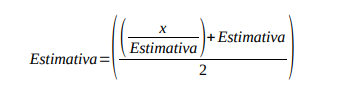

<div style="text-align: center;">
  <h2>Relatório 04 | Organização de computadores I - INE5411</h2>
</div>

**Alunos**: Pedro Henrique Gimenez - 23102766
Victória Rodrigues Veloso - 23100460 

---

# 1. Exercício 1

Para o primeiro exercício, o método iterativo de newton foi implementado para encontrar a raiz quadrada de um número utilizando a fórmula de estimativa da figura 1

<div style="text-align: center;">
    
    <p style="font-style: italic; font-size: 12px;">Figura 1. Estimativa da raiz quadrada através do método de newton</p>
</div>


## 1.1 Implementação


### 1.1.1 Scrip python

Para implementar o código em assembly, inicialmente foi criado um script em Python. Isso foi feito com o objetivo de fornecer uma visão mais clara dos passos a seguir. O algoritmo em linguagem de alto nível foi elaborado para se assemelhar o máximo possível ao que seria feito em assembly, com a distinção entre labels e a declaração de variáveis de forma clara e organizada.

```python
def raiz_quadrada(x, n):
    # Estimativa inicial
    estimativa = 1.0

    # Loop para calcular n valores de estimativa
    for _ in range(n):
        # Calcula a nova estimativa usando o método de Newton
        estimativa = (( x / estimativa)+estimativa) / 2.0

    return estimativa

def main():
    # Solicita o número e a quantidade de iterações ao usuário
    x = float(input("Digite o número para calcular a raiz quadrada: "))
    n = int(input("Digite o número de iterações desejadas: "))

    # Calcula a estimativa da raiz quadrada usando o método de Newton
    estimativa_final = raiz_quadrada(x, n)

    # Exibe o resultado
    print(f"A estimativa da raiz quadrada de {x} após {n} iterações é: {estimativa_final}")

if __name__ == "__main__":
    main()

```
### 1.1.2 Implementação assembly
Iniciamos o código alocando as variáveis nos registradores e, em seguida, realizamos chamadas no sistema para captar os valores de x (valor para o qual queremos descobrir a raiz quadrada) e n (número de iterações). Após isso, o procedimento 'raiz_quadrada' é invocado.
Dentro do procedimento, um registrador chamado 'estimativa' é iniciado com o valor 1.0, enquanto outro registrador é inicializado com a constante a ser usada para a divisão.
Em seguida, um loop é executado até que o número de iterações 'n' alcance zero. Durante cada iteração do loop, um registrador temporário, como $f2, é utilizado para armazenar os cálculos parciais.

```assembly
raiz_quadrada:


	l.d $f4, 0($s2)			#inicia o registrador estimativa com 1.0
	li $t0, 2			#inicia a constante 2
	mtc1 $t0, $f6			#manda para f6
	cvt.d.w $f6,$f6			#converte para double

    loop:   
 	addi $a0, $a0,-1		#decrementa o valor de n (iterações)
	div.d $f2, $f0, $f4 		#registrador auxiliar(f2) = (x/estimativa)
  	add.d $f2,$f2, $f4		#registrador auxiliar(f2) = (x/estimativa) + estimativa
 	div.d $f2, $f2, $f6		#registrador auxiliar(f2) = (x/estimativa) + estimativa/2
 	mov.d $f4, $f2			#atualiza a estimativa
 	bnez $a0, loop		#se n != 0, vai para o loop e repete novamente, caso contr�rio volta para a main

 	jr $ra				#volta para a main

```
Após o final dos cálculos (quando o número de iterações é igual a 0). Voltamos para a "main" e o resultado é armazenado na memória.

### 1.1.3 Erro absoluto

Após armazenar o resultado, a raiz quadrada é encontrada através da instrução "sqrt.d", a fim de comparar os resultados obtidos. 

```
Para n = 5
Erro = abs(1.414213562373095 - 1.4142135623730951)/1.4142135623730951*100
Erro = 1.57009245868377E-14
```

```
Para n = 20 
Erro = abs(1.41213562373095 - 1.412135623730951)/1.412135623730951 *100
Erro = 7.86201414345654E-14
```
```
Para n = 50 
Erro = abs(1.41213562373095 - 1.412135623730951)/1.412135623730951 *100
Erro = 7.86201414345654E-14
```

Conforme o número de iterações aumenta, o erro absoluto diminui, conforme esperado. Também é possível observar que o algoritmo converge antes de 20 iterações;


# 1.2 Execução do programa
####fazer