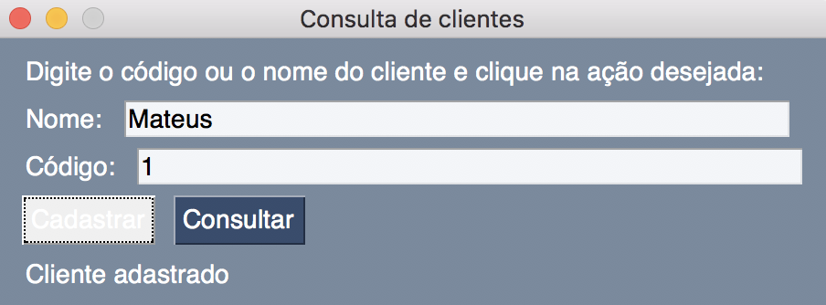
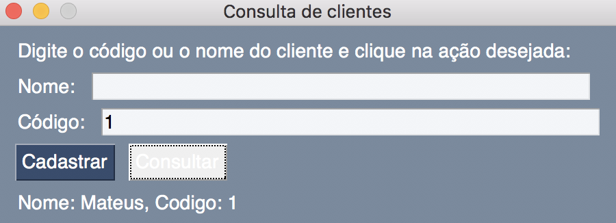

# ine5404-aula-GUI
Exemplo de um sistema de cadastro de clientes utilizando o padrão MVC (Model, View, Controller)

O sistema deve executar as seguintes funcionalidades:
 - Cadastro de novos usuários
 - Consulta de usuários cadastrados por nome ou por código
 
Os trechos de código que devem ser corrigidos estão indicados com o comentário **#FIX ME**.

Implemente o código mais resistente a crashes possível e informe seu usuário quando algo inesperado ocorrer.

## Extra:
 - Implemente uma função que remove cadastros
 - Implemente uma função que lista todos clientes cadastrados

As telas a seguir mostram exemplos do funcionamento esperado:

