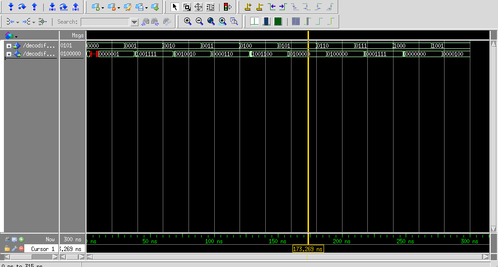

  <h2>Relatório 01 | Grupo 04</h2>

**Alunos**: Pedro Henrique Gimenez (matrícula: 23102766) e Victória Rodrigues Veloso (matricula: 23100460)

---

# Circuitos e simulações

## 1. Multiplexador:

### 1.1 Arquitetura

Para o circuito do multiplexador, a arquitetura do componente foi completada de acordo com a tabela verdade fornecida. A saída desejada será enviada de acordo com o valor indicado para sel. Na imagem abaixo é possível observar as saídas obtidas quando sel=00

### 1.2 Simulação
Na simulação, foi fornecido no arquivo de estimulos valores fixos para cada entrada de "b" até "d" e valores alternados em 30 ns para "a" e "sel". O motivo de alterar "a" foi para testar se o multiplexador fazia a troca do valor de "a" quando ele estivesse selecionado.

Pela simulação (Figura 1), é possível notar que a simulação foi bem sucedida e os valores foram alterados corretamente conforme os delays.

    
    
Figura 1: Simulação do multiplexador de 4 entradas

## 2. Demultiplexador:

### 2.1 Arquitetura
Para o circuito do demultiplexador, implementamos a arquitetura utilizando *process*. Sendo assim, as variáveis sensíveis às mudanças nos sinais (f e sel) foram indicadas e usadas como paramêtros para que a modelagem do comportamendo seja implementada de acordo com a tabela verdade fornecida.

### 2.2 Simulação
Para a simulação do demultiplexador, colocamos o sinal "f" desligado por 30 ns e depois o ativamos para conferir o funcionamento do sistema. O sinal "sel" foi configurado para alterar de 1 em 1 a cada 50 ns. Pela simulação (Figura 2), é possível notar que o sistema funcionou corretamente segundo a tabela verdade.

    
    
Figura 2. Simulação do demultiplexador

## 3. Decodificador BCD para Display de 7 segmentos usando expressões lógicas

### 3.1 Arquitetura
O circuito decodificador BCD para display de 7 segmentos utilizando **expressões lógicas** foi implementado utilizando a interface em que a saída fosse única e de 7 bits, essa escolha foi feita devido a uma maior familiaridade. Para efetuar a montagem da arquitetura foram montados 7 mapas de karnaught (1 para cada display).

### 3.2 Simulação
Para a simulação, colocamos o sinal "bcd" para variar de 1 em 1 a cada 30 ns até chegar ao número 9 em binário. Após realizar a simulação (Figura 3) pode-se concluir que todos os números estão corretos segundo a tabela verdade.

    
    
Figura 3. Simulação do Decodificador BCD para Display de 7 segmentos usando expressões lógicas

## 4. Decodificador BCD para Display de 7 segmentos usando *case*

### 4.1 Arquitetura
Para o circuito utilizando *case*, não foi nescessário realizar a montagem dos mapas de karnaught, uma vez que o utilizar *process* permite a inserção direta dos bits desejados. Usamos a mesma interface utilizada anteriormente com a saída única de 7 bits.

### 4.2 Simulação
Para a simulação, utilizamos o mesmo estímulo usado anteriormente já que possuem a mesma interface e objetivo final. Pela simulação (Figura 4), é possível notar que todas as saídas estão de acordo com a tabela verdade do sistema.

    
    
Figura 4. Simulação do Decodificador BCD para Display de 7 segmentos usando case

