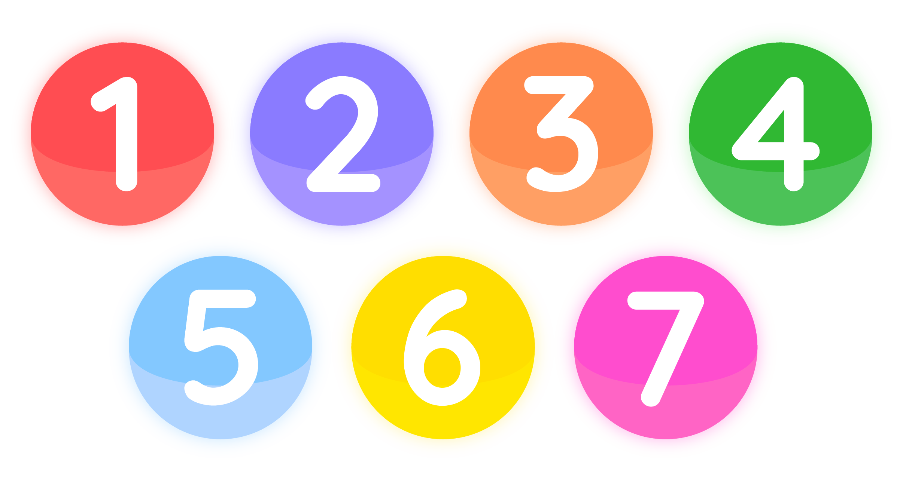

# Projeto Soma 10

### Especificação de Requisitos de Software
Versão 1.0
<!-- comando para iniciar linhas de divisão da tabela-->
30/09/2024
 

| Versão   | Autor(es)     | Data    | Ação|
|:-----------:|:----------:|:-----------:|:-----------:|
| 1.0   |Pedro Felipe Menezes,   Pedro Henrique Gimenez e   Victória Rodrigues Veloso   | 30/09/2024   | Estabelecimento dos requisitos  |

### Conteúdo:

1. Introdução
2. Visão Geral
3. Requisitos de Software

Apêndice: Regras do jogo Soma 10 

 <!-- comando para iniciar nova pagina -->

## 1. Introdução 

### 1.1 Objetivo

Desenvolvimento de um programa distribuído que suporte a disputa de partidas do jogo Soma 10, na modalidade usuário contra usuário.

### 1.2 Definiçõs e abreviaturas

Regras do jogo: ver apêndice.

### 1.3 Referência

Apresentação das regras do jogo (video do canal Booktoy Livraria e Editora):
https://youtu.be/1ZkDNbzL2qE

## 2. Visão Geral

### 2.1 Arquitetura do programa

O software desenvolvido conta com a arquitetura cliente-servidor distribuído.

### 2.2 Premissas de desenvolvimento

- O programa deve ser implementado em Python;
- O programa deve utilizar DOG como suporte de execução distribuída;
- O projeto deve ser produzido utilizando a linguagem UML, segunda versão.

## 3. Requisitos de Software

### 3.1 Requisitos funcionais

**Requisito funcional 1 - Iniciar programa:**  Ao ser executado, o programa deve apresentar na primeira interface (menu inicial) um botão para iniciar a partida. O programa deve solicitar ao usuário para ele escrever seu nome e depois solicitar conexão com o DOG Server, utilizando os recursos do DOG.

**Requisito funcional 2 - Iniciar jogo:** O programa deve permitir ao jogador iniciar uma nova partida clicando no botão “iniciar” no menu inicial. Ao selecionar esta opção, o programa deve exibir a interface da partida e enviar uma solicitação de início ao Dog Server. O programa deve receber uma confirmação de início da partida pelo DOG quando outro jogador estiver conectado. Até receber essa confirmação, o programa deve permanecer inoperante para o usuário. Com a confirmação recebida, o programa deve iniciar a partida, distribuindo 3 fichas aleatórias do baralho para cada jogador. A interface deve estar habilitada para o jogador que iniciou a solicitação de início de jogo realizar a primeira jogada. Caso o jogo não possa ser iniciado, o servidor deve retornar o motivo da impossibilidade e o programa deve informar o usuário.

**Requisito funcional 3 - Colocar uma ficha no tabuleiro:** O programa deve permitir que o jogador selecione uma ficha da sua mão e a posicione apenas em uma casa válida no tabuleiro, conforme as regras descritas no apêndice. O programa deve calcular as casas onde a ficha pode ser colocada, destacá-las no tabuleiro e bloquear a interação nas demais, de acordo com as condições específicas do jogo. Após a colocação da ficha, o programa deve comprar uma nova ficha do baralho se houver, verificar se houve pontuação "soma 10", enviar a jogada ao adversário utilizando os recursos do DOG e passar a vez para o próximo jogador.

**Requisito funcional 4 - Enviar jogada:** O programa deve, por meio do DOG Server, enviar dados ao fim de uma jogada para o jogador remoto. Os dados enviados devem conter o tabuleiro atual, a pontuação atual do jogador, o deck após as compras do jogador e a natureza do movimento.

**Requisito funcional 5 - Verificar soma de 10:** Ao posicionar uma ficha, o programa deve automaticamente verificar se a soma das fichas em uma linha, coluna ou diagonal resulta em 10 e, em caso afirmativo, recolher as 4 fichas dessa linha e somar 4 pontos à pontuação do jogador que fez a última jogada. O programa deve exibir uma mensagem na área “Avisos do Jogo” informando aos jogadores que houve uma pontuação.

**Requisito funcional 6 - Verificar impossibilidade de jogada:** Ao tentar comprar uma carta, o programa deve verificar se o jogador possui alguma jogada válida com as fichas em sua mão. Se nenhuma jogada for possível, o programa deve verificar se ainda há fichas no baralho. Se não houver mais fichas no baralho, o programa deve enviar a jogada e encerrar a partida.

**Requisito funcional 7 - Receber determinação de início:** O programa deve poder receber uma notificação de início de partida, originada do Dog Server, a partir da solicitação de ínicio de partida do outro jogador conectado ao servidor. Em que o jogador que solicitou o início da partida é o primeiro a jogar.

**Requisito funcional 8 - Controlar equidade de fichas:** O programa deve garantir que, antes de iniciar a jogada de um jogador, ambos os jogadores tenham a mesma quantidade de fichas em suas mãos. Quando inicia o turno de um jogador, o programa verifica a quantidade de cartas dele comparada com a do outro jogador, se a quantidade de fichas estiver desigual, o programa deve, automaticamente, comprar as fichas necessárias para esse jogador, desde que ainda haja fichas disponíveis no baralho (verificando impossibilidade de jogada). A jogada só será liberada após essa condição ser satisfeita.

**Requisito funcional 9 - Receber jogada do adversário:** O programa deve receber a jogada do adversário enviada pelo Dog Server. A jogada recebida contém o tabuleiro atual, a pontuação atual do jogador, o deck após as compras do jogador e uma variável que indica a natureza da jogada. Ao receber a jogada, o programa deve atualizar o tabuleiro conforme necessário, a pontuação do jogador remoto e o deck de compras. Se o programa receber que a partida foi encerrada, ele deve exibir o jogador vencedor.

**Requisito funcional 10 - Receber notificação de abandono:** O sistema deve ser capaz de receber uma notificação de desistência da partida enviada pelo adversário remoto, através do Dog Server. Neste cenário, o jogo deve ser considerado finalizado, a desistência deve ser reportada na interface e o programa encerrado.

**Requisito funcional 11 - Exibir o placar:** O sistema deve exibir o placar, mostrando a pontuação total de cada jogador durante todo o jogo.

### 3.2 Requisitos Não Funcionais
**Requisito não funcional 1 - Tecnologia para interface gráfica:** O framework Tkinter deve ser utilizado para a construção da interface gráfica.

**Requisito não funcional 2 - Suporte para especificação de projeto:** a especificação de projeto deve ser produzida com a ferramenta Visual Paradigm.

**Requisito não funcional 3 - Modelo de interface gráfica:** A interface gráfica deve ser construída com base nas figuras 1 e 2.

    
    
Figura 1. Interface do menu inicial do jogo.  

    
    
Figura 2. Interface da partida.  

 <!-- comando para iniciar nova pagina -->

## Apêndice: Regras do jogo Soma 10

O jogo Soma 10 consiste na disputa entre dois participantes em um tabuleiro de 16 casas interligadas entre si. O objetivo do jogo é conseguir o maior número de fichas através de somas que resultam em 10.

#### Elementos do jogo

Ao total o baralho conta com 66 fichas enumeradas de 1 a 7, sendo: 

- 18 fichas número 1;
- 18 fichas número 2;
- 14 fichas número 3;
- 8 fichas número 4;
- 4 fichas número 5;
- 2 fichas número 6;
- 2 fichas número 7.

    

Figura 3. Fichas do jogo Soma 10.  

E um tabuleiro com 16 casas interligadas entre si:

    

Figura 4. Tabuleiro do jogo Soma 10.  

#### Como jogar

1. Cada jogador começa a partida com 3 fichas na mão.
2. O jogador escolhe uma de suas fichas para colocar no tabuleiro, depois deve comprar uma nova ficha do monte.
3. Ao final de cada rodada, todos os jogadores devem ter exatamente o mesmo número de fichas. Caso um jogador tenha menos fichas, este deverá comprar no monte, se houver, até que seu número de fichas seja igual ao do outro jogador.
4. Se, durante a sua vez, o jogador conseguir somar 10 em uma linha vertical, horizontal ou diagonal, ele recolhe todas as 4 fichas dessa soma.
   
Exemplos de jogada:

    
    

Figura 5. Exemplos de jogadas válidas.  

5. O jogo termina quando um dos competidores não puder mais realizar uma jogada, considerando as regras de jogada (descritas a seguir). Vence a partida quem possuir o maior número de pontuação.

##### Regras de jogada:
- Ao inserir a segunda ficha em uma fileira, a soma das duas primeiras fichas deve ser igual ou inferior a 8. Ao adicionar a terceira ficha, a soma das três fichas da fileira deve ser igual ou inferior a 9. 

- O competidor que colocar a quarta ficha, completando a soma de 10, recolhe todas as fichas daquela fileira e as guarda para a contagem final de pontos. Após isso, a vez passa para o próximo jogador.

- Se um jogador não puder realizar uma jogada com as fichas em sua mão, ele deve comprar uma ficha do monte e passar sua vez.

- Quando não houver mais fichas no monte, o jogador realiza sua jogada, se possível, e em seguida passa a vez para o próximo jogador.